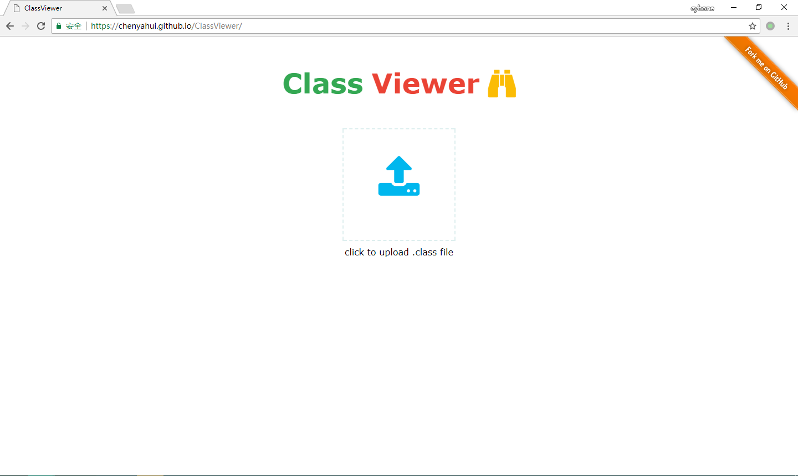
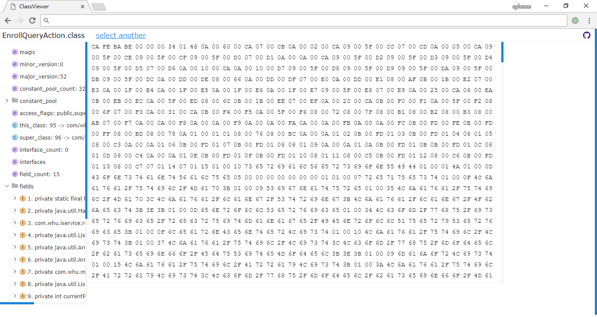

# ClassViewer

ClassViewer is a tool for investigating Java class files. It is fully developed using Javascript on browser.

## How To Use
Since it only depends on browser,you can download source code from github, Open the file in your browser and Enjoy it!

## Screenshots

## TODO
* redraw bytecode area when resize window 
* show opcode of method 
* try to explain every part of classfile

## Reference
* [javap](https://docs.oracle.com/javase/8/docs/technotes/tools/windows/javap.html)
* [Java-Class-Viewer](https://www.codeproject.com/Articles/35915/Java-Class-Viewer)
* [Classpy](https://github.com/zxh0/classpy)